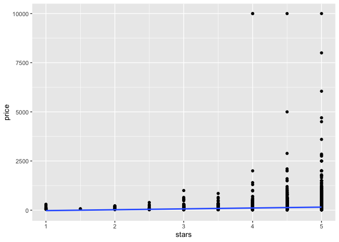
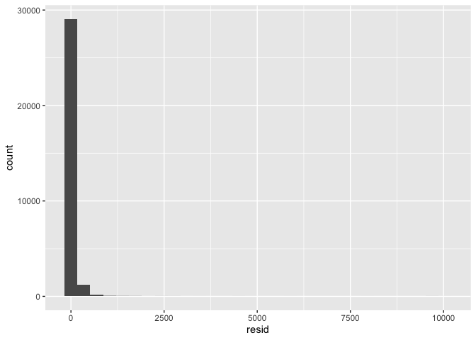
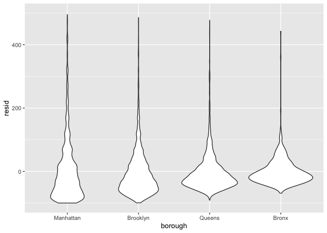

Linear Model
================
Miriam Lachs
2024-11-07

Do some data cleaning

``` r
data("nyc_airbnb")

nyc_airbnb = 
  nyc_airbnb |> 
  mutate(stars = review_scores_location / 2) |> 
  rename(
    borough = neighbourhood_group,
    neighborhood = neighbourhood) |> 
  filter(borough != "Staten Island") |> 
  select(price, stars, borough, neighborhood, room_type) %>% 
  mutate(borough = fct_infreq(borough),
         room_type = fct_infreq(room_type))
```

## Fit some models

Start simpple

``` r
fit = lm(price ~ stars, data = nyc_airbnb)

summary(fit)
```

    ## 
    ## Call:
    ## lm(formula = price ~ stars, data = nyc_airbnb)
    ## 
    ## Residuals:
    ##    Min     1Q Median     3Q    Max 
    ## -144.1  -69.1  -32.0   25.9 9889.0 
    ## 
    ## Coefficients:
    ##             Estimate Std. Error t value Pr(>|t|)    
    ## (Intercept)  -66.500     11.893  -5.591 2.27e-08 ***
    ## stars         44.115      2.515  17.538  < 2e-16 ***
    ## ---
    ## Signif. codes:  0 '***' 0.001 '**' 0.01 '*' 0.05 '.' 0.1 ' ' 1
    ## 
    ## Residual standard error: 183.8 on 30528 degrees of freedom
    ##   (9962 observations deleted due to missingness)
    ## Multiple R-squared:  0.009974,   Adjusted R-squared:  0.009942 
    ## F-statistic: 307.6 on 1 and 30528 DF,  p-value: < 2.2e-16

``` r
names(fit)
```

    ##  [1] "coefficients"  "residuals"     "effects"       "rank"         
    ##  [5] "fitted.values" "assign"        "qr"            "df.residual"  
    ##  [9] "na.action"     "xlevels"       "call"          "terms"        
    ## [13] "model"

``` r
coef(fit)
```

    ## (Intercept)       stars 
    ##   -66.50023    44.11475

``` r
broom::tidy(fit)
```

    ## # A tibble: 2 × 5
    ##   term        estimate std.error statistic  p.value
    ##   <chr>          <dbl>     <dbl>     <dbl>    <dbl>
    ## 1 (Intercept)    -66.5     11.9      -5.59 2.27e- 8
    ## 2 stars           44.1      2.52     17.5  1.61e-68

``` r
fit %>% 
  broom::tidy() %>% 
  select(term,estimate, p.value)
```

    ## # A tibble: 2 × 3
    ##   term        estimate  p.value
    ##   <chr>          <dbl>    <dbl>
    ## 1 (Intercept)    -66.5 2.27e- 8
    ## 2 stars           44.1 1.61e-68

``` r
fit %>% 
  broom::glance()
```

    ## # A tibble: 1 × 12
    ##   r.squared adj.r.squared sigma statistic  p.value    df   logLik     AIC    BIC
    ##       <dbl>         <dbl> <dbl>     <dbl>    <dbl> <dbl>    <dbl>   <dbl>  <dbl>
    ## 1   0.00997       0.00994  184.      308. 1.61e-68     1 -202491. 404989. 4.05e5
    ## # ℹ 3 more variables: deviance <dbl>, df.residual <int>, nobs <int>

TRy a bit more complex

``` r
fit= 
  lm(price~ stars+borough, data = nyc_airbnb)

fit %>% 
  broom::tidy() %>% 
  select(term,estimate, p.value) %>% 
  mutate(
    term = str_replace(term, "borough",'Borough: ')
  ) %>% 
  knitr::kable()
```

| term              |  estimate |  p.value |
|:------------------|----------:|---------:|
| (Intercept)       |  19.83946 | 0.103616 |
| stars             |  31.98989 | 0.000000 |
| Borough: Brooklyn | -49.75363 | 0.000000 |
| Borough: Queens   | -77.04776 | 0.000000 |
| Borough: Bronx    | -90.25393 | 0.000000 |

## Some diagnostics

(backtrack to some EDA)

``` r
nyc_airbnb %>% 
  ggplot(aes(x=stars, y= price))+
  geom_point()+
  stat_smooth(method = 'lm')
```

    ## `geom_smooth()` using formula = 'y ~ x'

    ## Warning: Removed 9962 rows containing non-finite outside the scale range
    ## (`stat_smooth()`).

    ## Warning: Removed 9962 rows containing missing values or values outside the scale range
    ## (`geom_point()`).

<!-- -->

Most diagnostics use residual

``` r
modelr::add_residuals(nyc_airbnb,fit) %>% 
  ggplot(aes(x= resid))+geom_histogram()
```

    ## `stat_bin()` using `bins = 30`. Pick better value with `binwidth`.

    ## Warning: Removed 9962 rows containing non-finite outside the scale range
    ## (`stat_bin()`).

<!-- -->

``` r
modelr::add_residuals(nyc_airbnb,fit) %>% 
  ggplot(aes(x= borough, y=resid))+geom_violin()+ylim(-100,500)
```

    ## Warning: Removed 12086 rows containing non-finite outside the scale range
    ## (`stat_ydensity()`).

<!-- -->

residuals against stars

``` r
modelr::add_residuals(nyc_airbnb,fit) %>% 
  ggplot(aes(x= stars, y=resid))+geom_point()
```

    ## Warning: Removed 9962 rows containing missing values or values outside the scale range
    ## (`geom_point()`).

<!-- -->

REsidual against fitted values

``` r
nyc_airbnb %>% 
  modelr::add_residuals(fit) %>% 
  modelr::add_predictions(fit) %>% 
  ggplot(aes(x=pred,y=resid))+
  geom_point()
```

    ## Warning: Removed 9962 rows containing missing values or values outside the scale range
    ## (`geom_point()`).

<!-- -->
